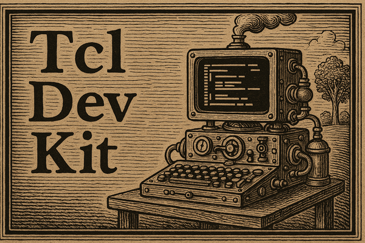

# Tcl Dev Kit (TDK)

# Overview

Tcl Dev Kit (TDK) includes everything you need for fast development of self-contained, easily-deployable applications. Turn your Tcl programs into ready-to-run executables, starkits or starpacks, for Windows, Mac OS X, Linux, Solaris, AIX and HP-UX.

Simplify development with tools for finding and fixing bugs, managing complex code bases and optimizing your programs. Easily reveal unused or overused code with the coverage and hotspot analyzer. Take control and work the way you want with a choice of GUIs or command line interfaces for most tools.


# General structure / directory organization

   * app - application sources, including main entry points. Some
     debug helper code which can be sourced by apps.

   * data - Images used by the apps.

   * docs - Internal dev notes and the official documentation.

   * lib - All the supporting packages. Some overlap with the `teapot`
     project.

   * misc - A hack-week project, incomplete, which never made it into
     the product.

   * pkg-src - Sources for the `win32 package. Written in C for access
     to some Windows system information (mainly paths).

# Images

   * `data/images/about.gif` is a placeholder for the background image
     of an about dialog. The supplied image is all-grey.

     Note: It is actually not clear if this image is still referenced,
     and if yes, where.

   * `artwork/splash.png` is a similar placeholder, for the splash
     screen.

     Note: The places referencing this image (`app/*/main.tcl`) are
     written on the assumption of unwrapped execution in the directory
     structure of the checkout. The knowledge of the expected
     structure is used to locate the image relative to the code file
     referencing it.

     For wrapped execution the original build system put the file
     `main_std.tcl` into the app as `ms.tcl` and added the splash
     setup code referencing the wrapped image.

# Building

## Windows

1. Install [MSYS2](https://www.msys2.org/).
2. Open a UCRT64 terminal (_Start > MSYS2 > MSYS2 UCRT64_) and install the build tools:
    ```sh
    pacman -S git mingw-w64-ucrt-x86_64-gcc autotools
     ```

3. Clone the TDK repository:
    ```sh
    git clone https://github.com/tclmonster/tdk.git
    cd tdk
    ```

4. Build dependencies:
   ```sh
   ./scripts/build_deps.sh
   ```

4. Build TDK and wrap each application as a separate starkit.
   ```sh
   ./configure --with-tcl="$(pwd)"/build/libtclkit-sdk-*/lib
   make
   ```
   _Note: it is also possible to build the applications as starpacks (standalone executables)
   by supplying the `--with-tclkit` flag to configure along with a path to a base tclkit._

# License
Copyright (c) 2024, Bandoti Ltd. and contributors

Copyright (c) 2018, ActiveState Software

Tcl Dev Kit (TDK) is released under the BSD-3 license. See LICENSE file for details.
